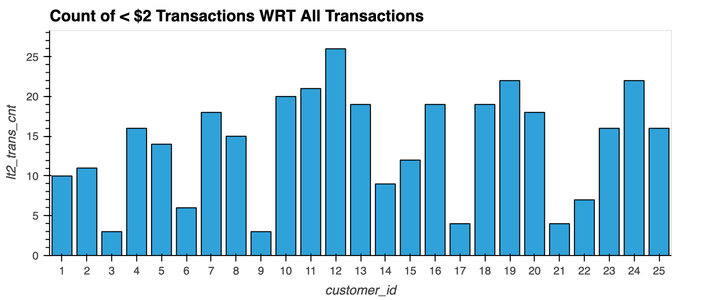
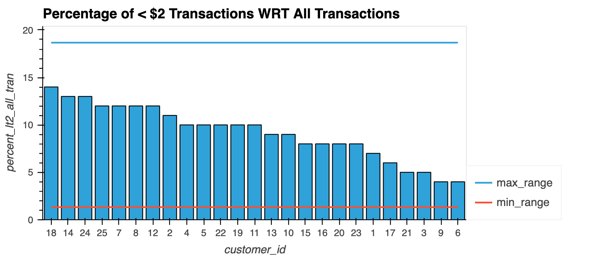
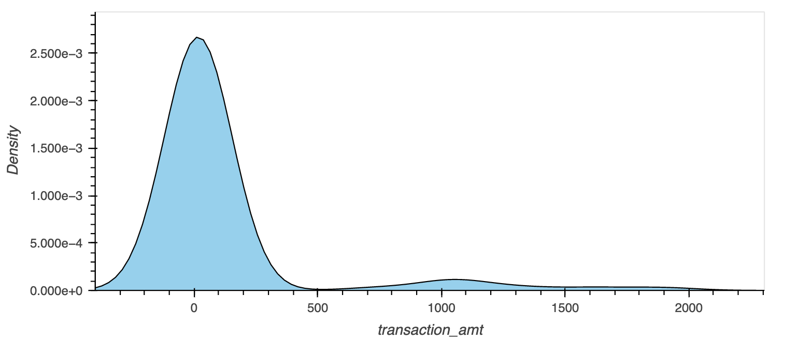
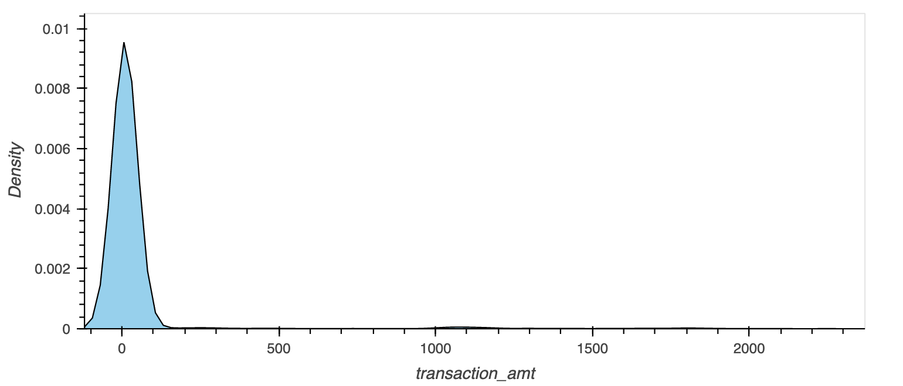
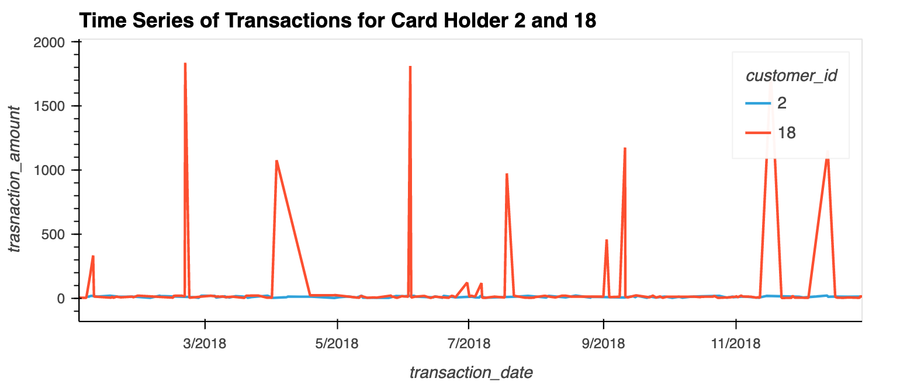
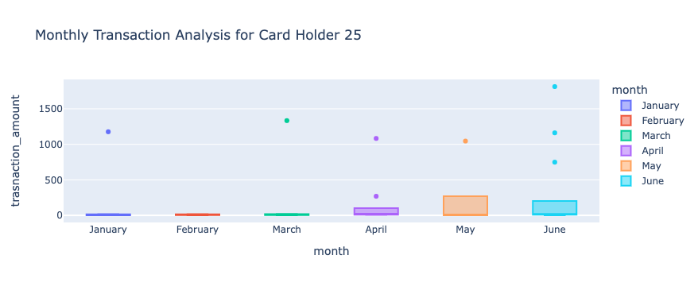

# SQL-Homework
### Data Analysis

### Part 1:
Some fraudsters hack a credit card by making several small transactions (generally less than $2.00), which are typically ignored by cardholders.
- How can you isolate (or group) the transactions of each cardholder?
  - Response: 
  Merge credit_cards, merchant, merchant_category and transactions tables together to get a consolidated view of the data including card_holder_id (customer_id) which will help in isolating the transactions of each cardholder.
- Count the transactions that are less than $2.00 per cardholder.
  - Response:

- Is there any evidence to suggest that a credit card has been hacked? Explain your rationale.
  - Response:
Standard Deviation based outlier test shows that percentage of < USD 2 transactions with respect to all the transactions for all the customers are within +/-3 standard deviation. Hence, data is not showing signs of fradulent activities

Take investigation a step futher by considering the time period in which potentially fraudulent transactions are made.

- What are the top 100 highest transactions made between 7:00 am and 9:00 am?
  - Response
  Half of the top 100 highest transactions took place in bar which is odd given all high value transactions took place in the early morning of working days.
  
|category_name|	transaction_amt|
|-------------|----------------|
|bar|	6043.19|
|restaurant|	2489.11|
|coffee shop|	1400.54|
|pub|	960.69|
|food truck|	472.99|

- Do you see any anomalous transactions that could be fraudulent?
  - Response: Tail of the chart shows that there might be anomalous transactions
  
  
- Is there a higher number of fraudulent transactions made during this time frame versus the rest of the day?
  - Response: It is hard to say as rest of the day chart also shows same kind of tail as 7 to 9 am chart.

- What are the top 5 merchants prone to being hacked using small transactions?
  - Resposne: Data is not sufficient to figure out the top 5 merchant prone to being hacked

### Part 2:
- The two most important customers of the firm may have been hacked. Verify if there are any fraudulent transactions in their history. For privacy reasons, you only know that their cardholder IDs are 2 and 18.
  - Response
  
  
  
  - Card Holder2 - All transactions are within a range and no abnormal pattern has been observed. Hence no fradulent activities
  - Card Holder18 - Spending pattern is not consistent. There are spikes in spending and it could be
    - Genuine seasonal spending by customer or
    - fradulent activities
   
  Contact Card Holder 18 to verify the transactions

- The CEO of the biggest customer of the firm suspects that someone has used her corporate credit card without authorization in the first quarter of 2018 to pay quite expensive restaurant bills. Again, for privacy reasons, you know only that the cardholder ID in question is 25.
  - Resposne:
  
  
  
  There are 8 transactions which are outliers. 2 in Q1 2018 and 6 in Q2 2018.
    - January - 1(1177)
    - March - 1(1,334)
    - April - 2 (269,1,083.21)
    - May - 1 (1,046)
    - June - 3 (749,1,162,1,813)

Considering the pattern of transactions following actions are required:
  - Block the card immediately (if not done already) and issue a new card to customer
  - Verify Q2 2018 outlier with customer
    - If customer identifies those transactions then further investigation is required to confirm if Q1 2018 transactions are fradulant as pattern is aligned to Q2 2018 transactions
    - If customer doesn't identify Q2 2018 transactions then all 8 outliers seems to be fradulent as these transactions are not according to customer behavior

